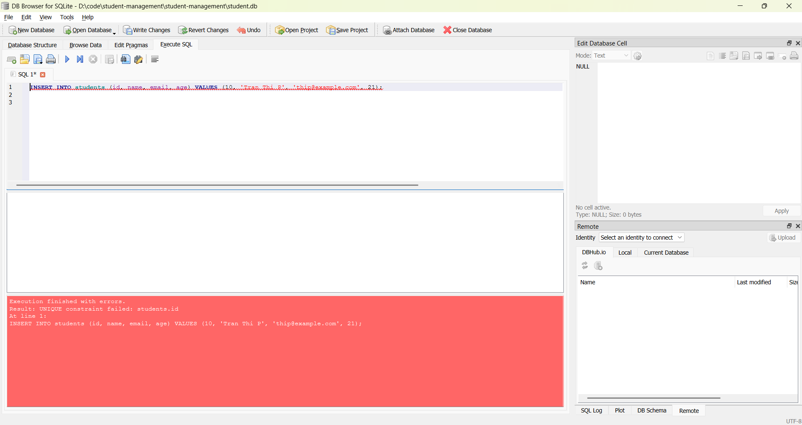
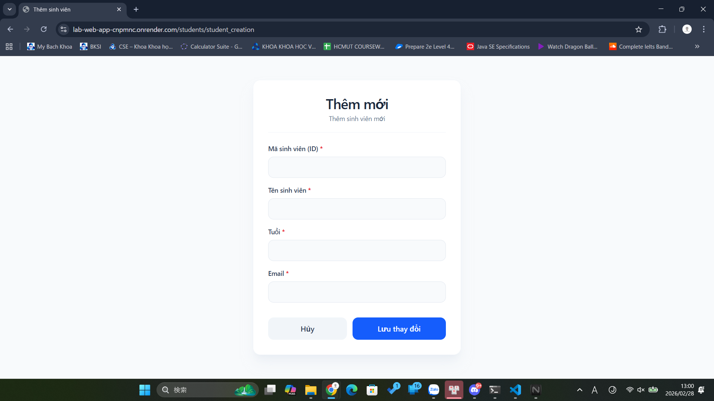
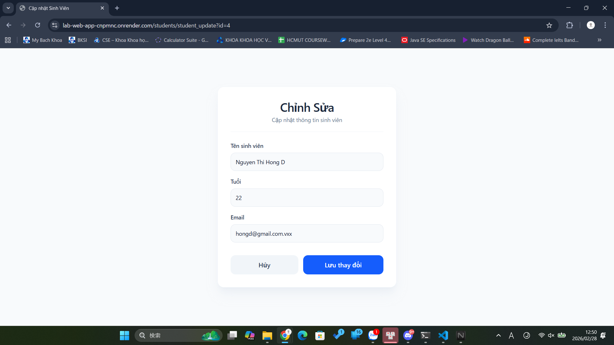
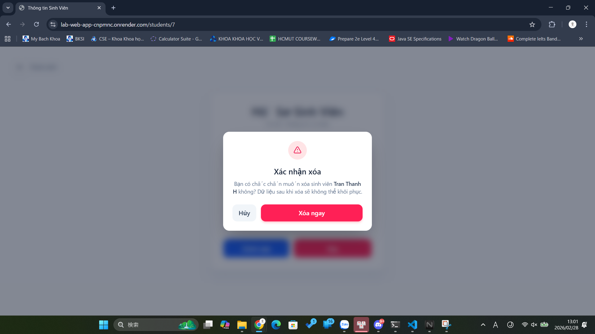

# BÁO CÁO THỰC HÀNH: XÂY DỰNG WEB APP CƠ BẢN

Tài liệu này cung cấp thông tin tổng quan, hướng dẫn cài đặt và báo cáo kết quả thực hiện các bài Lab trong môn Công Nghệ Phần Mềm Nâng Cao (CO3065) của sinh viên Trường Đại Học Bách Khoa - Đại Học Quốc Gia TP.HCM

## I. Thông tin chung

**1. Thông tin sinh viên**

| MSSV | Họ và tên |
| :--- | :--- |
| 2213533 | Nguyễn Minh Toàn |

**2. Đường dẫn triển khai (Deployment)**

Dự án đã được triển khai thực tế trên môi trường cloud. Quý thầy cô và người xem có thể truy cập trực tiếp thông qua liên kết sau:
🔗 **[https://lab-web-app-cnpmnc.onrender.com/](https://lab-web-app-cnpmnc.onrender.com/)**

---

## II. Hướng dẫn cài đặt và vận hành

### 1. Yêu cầu hệ thống (Prerequisites)
Để có thể biên dịch và chạy dự án trên môi trường cục bộ (local), máy tính cần được cài đặt sẵn các công cụ sau:
* **Git** (để quản lý phiên bản và tải mã nguồn)
* **JDK 21** (Java Development Kit phiên bản 21)
* **Maven** (Công cụ quản lý dự án và thư viện Java)

### 2. Các bước triển khai (Local Setup)

**Bước 1:** Mở ứng dụng Command Prompt (cmd) hoặc Terminal và điều hướng đến thư mục bạn muốn lưu trữ dự án.

**Bước 2:** Sử dụng lệnh sau để tải (clone) mã nguồn từ GitHub về máy:
```bash
git clone https://github.com/minhtoan-nmt/lab-web-app-cnpmnc.git
```

**Bước 3:** Di chuyển vào thư mục dự án vừa tải về và tiến hành khởi chạy ứng dụng bằng Maven:
```bash
mvn spring-boot:run
```

**Bước 4:** Kiểm tra kết quả. Sau khi console thông báo ứng dụng đã khởi động thành công, mở trình duyệt và truy cập vào địa chỉ: 
👉 `http://localhost:8080`

---

## III. Báo cáo kết quả thực hành

### 1. Lab 1: Các vấn đề liên quan đến Cơ sở dữ liệu

**Câu 1: Kết quả sau khi chèn thêm 10 sinh viên vào CSDL**
> Hệ thống ghi nhận dữ liệu thành công.


**Câu 2: Xử lý khi chèn một sinh viên có ID trùng với một người đã tồn tại**
> Kết quả: Báo lỗi.



* **Giải thích:** Database thông báo lỗi `UNIQUE constraints failed`. Lý do là vì trong một bảng dữ liệu, các khóa chính (Primary Key) phải độc lập và không được trùng lặp. Điều này là bắt buộc để phân biệt các bản ghi trong một bảng và ngăn chặn sự nhầm lẫn dữ liệu. Đây là điều kiện tiên quyết và cơ bản nhất trong thiết kế CSDL quan hệ (SQL).

**Câu 3: Chèn một sinh viên nhưng bỏ trống cột Name**
> Kết quả: Thao tác thành công.


* **Giải thích:** Khi chèn một bản ghi với cột `name` để trống (NULL), CSDL vẫn chấp nhận thao tác này. Tuy nhiên, điều này sẽ dẫn đến việc khi mã Java truy vấn và đọc dữ liệu lên, đối tượng sinh viên đó chỉ có ID mà không có tên. Hệ thống code sẽ phải tốn thêm chi phí xử lý logic để không trả về hoặc hiển thị lỗi các giá trị này. Mặc dù không gây sập chương trình ngay lập tức, nhưng nó rất dễ dẫn đến những bug liên quan đến logic nghiệp vụ, làm giảm độ tin cậy của ứng dụng.

**Câu 4: Hiện tượng mất dữ liệu cũ sau khi tắt và mở lại ứng dụng**
* **Giải thích:** Lý do là vì trong file `application.properties`, hệ thống đang được cấu hình `spring.jpa.hibernate.ddl-auto=create`. Cấu hình này chỉ định rằng mỗi khi khởi động lại ứng dụng, toàn bộ dữ liệu (schema) các bảng cũ sẽ được Drop (xóa đi) và tạo mới lại hoàn toàn dựa theo định nghĩa của các `@Entity` trong Java (nhờ sự trợ giúp của Spring Data JPA). Do đó, các bản ghi cũ từ phiên làm việc trước sẽ bị mất hoàn toàn.

---

### 2. Lab 4: Kết quả triển khai Giao diện (Screenshots)

Dưới đây là các ảnh chụp màn hình chứng minh chức năng của hệ thống ứng dụng:

**Giao diện danh sách sinh viên:**


**Giao diện thông tin chi tiết của sinh viên:**


**Giao diện tạo mới sinh viên:**


**Giao diện cập nhật/chỉnh sửa thông tin:**


**Hộp thoại (Modal) xác nhận xóa sinh viên:**
